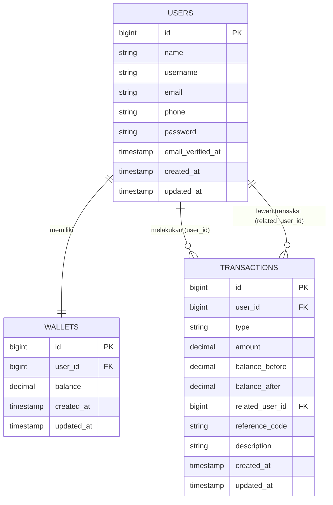

# 💳 Mini Wallet API & Dashboard

> Take Home Test — Exam Penyaluran Kerja, Full Stack Web Development Bootcamp (Dibimbing.id)

Sistem dompet digital sederhana dengan REST API yang aman (transactional integrity) dan dashboard SPA — dibangun untuk menunjukkan penguasaan authentication, database transaction safety, validasi ketat, dan clean architecture dalam satu siklus pengembangan penuh.

**🔗 Live Demo:** `https://mini-wallet-project.vercel.app/`
**📡 Backend API:** `https://mini-wallet-project-production.up.railway.app/`

---

## 📋 Daftar Isi

- [Fitur](#-fitur)
- [Tech Stack](#-tech-stack)
- [ERD (Entity Relationship Diagram)](#-erd-entity-relationship-diagram)
- [Struktur Repository](#-struktur-repository)
- [Cara Menjalankan](#-cara-menjalankan)
- [API Endpoints](#-api-endpoints)
- [Testing](#-testing)
- [Issue & Problem Solving](#-issue--problem-solving)
- [Author](#-author)

---

## ✨ Fitur

### Backend
- ✅ Autentikasi: Register & Login dengan Laravel Sanctum (token-based)
- ✅ Validasi ketat: format email, password minimal 8 karakter, username unik
- ✅ Wallet: cek saldo, top up, transfer antar user (by email/no. HP)
- ✅ **Transactional integrity** — debit & kredit dieksekusi dalam satu `DB::transaction()` dengan row locking, rollback otomatis kalau salah satu sisi gagal
- ✅ Validasi nominal: hanya integer, tidak boleh negatif/kosong/simbol, ada batas maksimum
- ✅ Riwayat mutasi (in & out) — scoped ketat per user, tidak bisa lihat punya user lain
- ✅ Error response konsisten dengan HTTP status yang sesuai (400/401/422)

### Frontend
- ✅ Dashboard SPA: Login, Saldo, Top Up, Form Transfer, Riwayat Transaksi
- ✅ Loading state di semua aksi (anti spam-click / double submit)
- ✅ Error handling jelas di UI (pesan error dari backend ditampilkan langsung)
- ✅ Desain dark mode sophisticated minimalist

---

## 🛠 Tech Stack

| Layer | Teknologi |
|---|---|
| Backend | Laravel 11, Laravel Sanctum |
| Database | MySQL |
| Frontend | React 18, Vite, Tailwind CSS |
| Icon | lucide-react |
| Deployment | Railway (backend), Vercel (frontend) |
| API Testing | Postman |

---

## 🗂 ERD (Entity Relationship Diagram)



**Catatan desain:**
- `USERS` ↔ `WALLETS` adalah relasi 1:1 (`unique` constraint di `wallets.user_id`).
- `TRANSACTIONS` punya 2 foreign key ke `USERS` — `user_id` (pemilik record) dan `related_user_id` (lawan transaksi). Satu transfer menghasilkan **2 baris** transaksi (`transfer_out` di sisi pengirim, `transfer_in` di sisi penerima) yang dipasangkan lewat `reference_code` yang sama — ini jadi audit trail untuk membuktikan transactional integrity.

---

## 📁 Struktur Repository

```
.
├── backend/                  # Laravel 11 + Sanctum
│   ├── app/
│   │   ├── Http/Controllers/Api/
│   │   ├── Http/Requests/      # Validasi (Register, Login, Topup, Transfer)
│   │   ├── Http/Resources/     # API response shape
│   │   ├── Models/
│   │   ├── Services/           # WalletService — core business logic
│   │   └── Exceptions/         # Custom exceptions (InsufficientBalance, dll)
│   ├── database/migrations/
│   ├── routes/api.php
│   └── bootstrap/app.php       # Global exception handling
│
├── frontend/                 # React 18 + Vite + Tailwind
│   ├── src/
│   │   ├── api/axios.js        # Axios instance + token interceptor
│   │   ├── context/AuthContext.jsx
│   │   ├── hooks/useWallet.js
│   │   ├── pages/               # Login, Register, Dashboard
│   │   └── components/          # BalanceCard, TransferForm, dll
│   └── tailwind.config.js
│
└── postman/                  # Postman collection + environment
    ├── Mini-Wallet-API.postman_collection.json
    └── Mini-Wallet-Local.postman_environment.json
```

---

## 🚀 Cara Menjalankan

### Prasyarat
- PHP ≥ 8.2, Composer
- Node.js ≥ 18, npm
- MySQL

### Backend

```bash
cd backend
composer install
cp .env.example .env
php artisan key:generate
```

Set di `.env`:
```env
DB_CONNECTION=mysql
DB_DATABASE=wallet_db
DB_USERNAME=root
DB_PASSWORD=
```

```bash
php artisan migrate
php artisan serve
```
Backend jalan di `http://localhost:8000`.

### Frontend

```bash
cd frontend
npm install
cp .env.example .env
```

Set di `.env`:
```env
VITE_API_URL=http://localhost:8000/api
```

```bash
npm run dev
```
Frontend jalan di `http://localhost:5173`.

---

## 📡 API Endpoints

| Method | Endpoint | Auth | Deskripsi |
|---|---|---|---|
| POST | `/api/register` | ❌ | Registrasi user baru |
| POST | `/api/login` | ❌ | Login, dapat Sanctum token |
| POST | `/api/logout` | ✅ | Revoke token aktif |
| GET | `/api/wallet` | ✅ | Lihat saldo |
| POST | `/api/topup` | ✅ | Tambah saldo |
| POST | `/api/transfer` | ✅ | Transfer ke user lain (by email/HP) |
| GET | `/api/transactions` | ✅ | Riwayat mutasi (scoped ke user login) |

Detail request/response body, contoh skenario invalid, dan error message — lihat Postman collection di folder `postman/`.

---

## 🧪 Testing

Import 2 file dari folder `postman/` ke Postman:
1. `Mini-Wallet-API.postman_collection.json`
2. `Mini-Wallet-Local.postman_environment.json`

Jalankan folder **"0. Setup"** dulu, lalu gunakan **Collection Runner** untuk run semua skenario sekaligus (termasuk skenario invalid: email format salah, password < 8 karakter, nominal berupa huruf/simbol/negatif, saldo tidak cukup, dll).

---

## 🐛 Issue & Problem Solving

| Issue | Problem | Solusi |
|---|---|---|
| **419 — CSRF Token Mismatch** | Sanctum `statefulApi()` aktif berbarengan dengan Bearer-token auth, memicu CSRF check yang tidak relevan | Nonaktifkan `statefulApi()` — konsisten pakai token-based auth tanpa cookie/CSRF |
| **Race Condition saat Transfer** | Dua request transfer bersamaan berisiko balapan baca-tulis saldo (lost update) | Row locking (`lockForUpdate`) dalam urutan ID konsisten + `DB::transaction()` untuk hindari deadlock |
| **Tailwind Tidak Termuat** | Setelah redesign, build cache lama membuat utility class baru tidak ter-compile | Reinstall dependency bersih (`rm -rf node_modules`) + hard refresh browser |

---

## 👤 Author

**Danu Trisna Juwana**
Teknik Informatika — UIN Sunan Gunung Djati Bandung
Full Stack Web Development Bootcamp — Dibimbing.id
